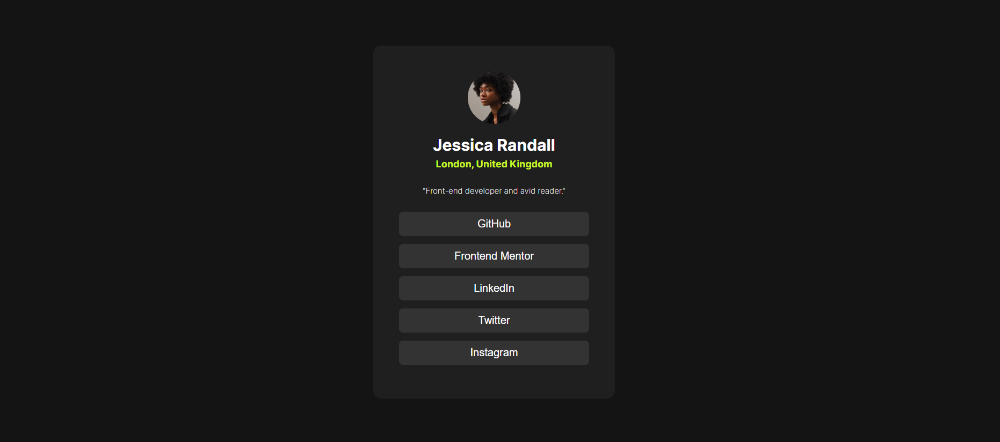

# Frontend Mentor - Social links profile solution

This is a solution to the [Social links profile challenge on Frontend Mentor](https://www.frontendmentor.io/challenges/social-links-profile-UG32l9m6dQ). Frontend Mentor challenges help you improve your coding skills by building realistic projects. 

## Table of contents

- [Overview](#overview)
  - [The challenge](#the-challenge)
  - [Screenshot](#screenshot)
  - [Links](#links)
- [My process](#my-process)
  - [Built with](#built-with)
  - [What I learned](#what-i-learned)
  - [Continued development](#continued-development)
  - [Useful resources](#useful-resources)
- [Author](#author)
- [Acknowledgments](#acknowledgments)

**Note: Delete this note and update the table of contents based on what sections you keep.**

## Overview

### The challenge

Users should be able to:

- See hover and focus states for all interactive elements on the page

### Screenshot

### Links

- Solution URL: [https://github.com/KerwinAngeles/Social-links-profile](https://your-solution-url.com)
- Live Site URL: [https://social-link-profile-ker.netlify.app/](https://your-live-site-url.com)

## My process

### Built with

- Semantic HTML5 markup
- CSS custom properties
- Flexbox

### What I learned

I learned how to use the custom properties, also I learned the correct way to define the box-sizing.

### Continued development

I'm going to continued development all the way of use color.

**Note: Delete this note and the content within this section and replace with your own plans for continued development.**

## Author

- Website - [Kerwin](https://www.your-site.com)
- Frontend Mentor - [@KerwinAngeles](https://www.frontendmentor.io/profile/yourusername)
